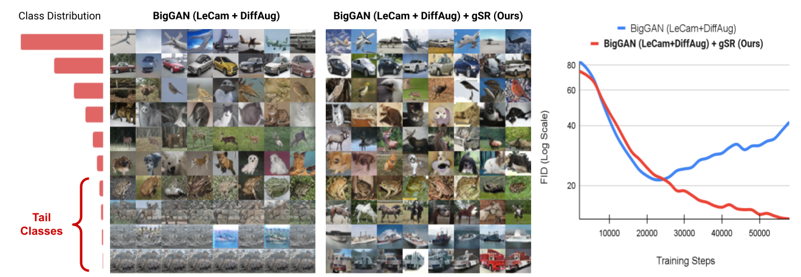

# Group Spectral Regularization for GANS
This repository contains code for the paper:

**Improving GANs for Long-Tailed Data through Group Spectral Regularization**  
[[Paper](https://arxiv.org/abs/2208.09932)][[ProjectPage](https://sites.google.com/view/gsr-eccv22)]  
[Harsh Rangwani](https://rangwani-harsh.github.io/), [Naman Jaswani](https://www.linkedin.com/in/naman-jaswani/), [Tejan Karmali](https://in.linkedin.com/in/tejank10/), [Varun Jampani](https://varunjampani.github.io/), [R. Venkatesh Babu](http://cds.iisc.ac.in/faculty/venky/)  
Indian Institute of Science, Google Research  
*European Conference on Computer Vision (ECCV) 2022*



Deep long-tailed learning aims to train useful deep networks on practical, real-world imbalanced distributions, wherein most labels of the tail classes are associated with a few samples. There has been a large body of work to train discriminative models for visual recognition on long-tailed distribution. In contrast, we aim to train conditional Generative Adversarial Networks, a class of image generation models on long-tailed distributions. We find that similar to recognition, state-of-the-art methods for image generation also suffer from performance degradation on tail classes. The performance degradation is mainly due to class-specific mode collapse for tail classes, which we observe to be correlated with the spectral explosion of the conditioning parameter matrix. We propose a novel group Spectral Regularizer (gSR) that prevents the spectral explosion alleviating mode collapse, which results in diverse and plausible image generation even for tail classes. We find that gSR effectively combines with existing augmentation and regularization techniques, leading to state-of-the-art image generation performance on long-tailed data. Extensive experiments demonstrate the efficacy of our regularizer on long-tailed datasets with different degrees of imbalance.


## Datasets
CIFAR-10 dataset will be downloaded automatically in ```./data``` folder in the project directory. 

For LSUN dataset download please follow the instructions [here](https://github.com/fyu/lsun) on how to download, then update the config file with the dataset path.

The **long-tailed** version of the LSUN and CIFAR-10 datasets will be created automatically by code.

For iNaturalist2019 dataset please download the files from the following link: [here](https://www.kaggle.com/competitions/inaturalist-2019-fgvc6/data). After download untar the images, following which use the script available [here](https://github.com/facebookresearch/classifier-balancing/blob/main/data/iNaturalist18/gen_lists.py) to create image file names.

## Requirements
For installing all the requirements use the following command:

``
conda env create -f environment.yml -n gsrgan
``

## Running Experiments of Paper
We provide examples of running the experiments for CIFAR-10 dataset. For other datasets the experiments can be run similarly by changing the path to appropriate configuration present in ``src/configs``. Our code base currently supports SNGAN and BigGAN architectures. We apply the state-of-the-art **LeCam and DiffAugment** regularization to obtain competent baselines.

### SNGAN

For running the proposed SNGAN with gSR use the command:

``python3 src/main.py -t -e --config_path ./src/configs/CIFAR10/SNGAN.json
``

### BigGAN


For running the proposed SNGAN with gSR use the command:

``python3 src/main.py -t -e --config_path ./src/configs/CIFAR10/BigGAN.json
``

For running the baseline experiments please set ``sn_regularize=false`` in the configuration files of the corresponding experiments. 

### Evaluation

For evaluation make the ``evaluation_checkpoint=True`` in configuration and specify ``--checkpoint_folder`` of the model while running the command, for getting the evaluation metrics. Please note that the validation metrics logged while training may be different from final evaluation metrics.


## Notes on Implementation
We have commented ``## Added `` for all the code addition done by the authors. The majority of implementation of gSR is present in the file ``src/utils/model_ops.py``.

## Acknowledgments and References
We thank the creators of awesome repository of [PyTorchStudioGAN]( https://github.com/POSTECH-CVLab/PyTorch-StudioGAN) on which our implementation is based on. 

## Citation
If you find our code or work useful in any way, please consider citing us:

```
@article{rangwani2022improving,
  title={Improving GANs for Long-Tailed Data through Group Spectral Regularization},
  author={Rangwani, Harsh and Jaswani, Naman and Karmali, Tejan and Jampani, Varun and Babu, R Venkatesh},
  journal={arXiv preprint arXiv:2208.09932},
  year={2022}
}
```
Please contact ``harshr@iisc.ac.in`` in case you have any comments or suggestions.
